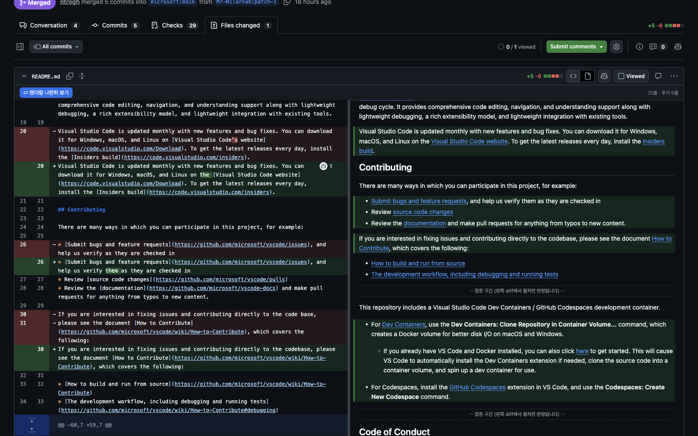

# GitHub MD Split Preview

GitHub의 변경 파일 화면(PR / commit / compare)에서 **마크다운 diff와 렌더링 결과를 좌우 2단으로 동시에** 보여주고, 스크롤을 서로 맞춰주는 유저스크립트입니다.

GitHub에는 source diff ↔ rich diff *토글*만 있어서 둘을 나란히 볼 수 없습니다. 이 스크립트가 그걸 채웁니다.



- 좌: 평소의 diff 그대로 (리뷰 코멘트 등 GitHub 기능 전부 유지)
- 우: 그 파일의 **변경 후** 내용을 렌더링한 결과
- 추가(`+`)된 줄이 들어간 블록은 렌더링 쪽에도 **초록 바**로 표시 → 변경이 실제 문서에서 어떻게 보이는지 바로 확인
- ````` ```mermaid ````` 블록은 GitHub 본문에서처럼 **다이어그램으로 그려집니다**
- 좌우 어느 쪽을 굴려도 **스크롤이 같은 줄에 맞춰집니다**
- 가운데 바를 드래그해 좌우 비율 조절 (설정은 브라우저에 저장)

---

## 설치

Tampermonkey 설치 → **`사용자 스크립트 허용` 켜기** → 스크립트 설치, 세 단계입니다.
2번을 빠뜨리면 설치해도 아무 일도 일어나지 않으니 꼭 확인하세요.

### 1. Tampermonkey 설치

[Tampermonkey](https://www.tampermonkey.net/) (Chrome / Edge / Firefox 등)

### 2. ⚠️ `사용자 스크립트 허용` 켜기 — 이걸 안 하면 아무것도 안 됩니다

Chrome 138부터 생긴 설정입니다. **꺼져 있으면 스크립트가 정상 설치·활성 상태여도 전혀 실행되지 않고, 콘솔에 에러조차 남지 않습니다.**

1. `chrome://extensions` → Tampermonkey → **세부정보**
2. **`사용자 스크립트 허용`** 토글 ON

> Tampermonkey 대시보드 상단에 "`사용자 스크립트 허용` 확장 설정을 활성화하세요" 배너가 보인다면 아직 꺼져 있는 것입니다.

### 3. 스크립트 설치

아래 링크를 열면 Tampermonkey 설치 화면이 뜹니다.

**[👉 설치하기](https://raw.githubusercontent.com/tpcint/gh-md-split-preview/main/github-md-split-preview.user.js)**

이후 업데이트는 Tampermonkey가 자동으로 받아옵니다.

## 사용법

PR의 변경 파일 화면을 열면 md 파일마다 헤더 아래에 이런 바가 생깁니다.

```
⇄ 렌더링 나란히 보기                    114줄 · 추가 114줄
```

버튼으로 켜고 끌 수 있고, 마지막 상태가 기억됩니다.

> **Unified diff에서 보세요.** Split diff 위에 2단을 얹으면 사실상 4단이 되어 매우 좁아집니다. Split이 감지되면 바에 안내가 표시됩니다.

## 동작 원리

diff DOM에 **이미 들어 있는** "변경 후" 라인을 긁어 마크다운 원문을 복원한 뒤 [marked](https://github.com/markedjs/marked)로 렌더링합니다.

**네트워크 요청이 없습니다.** 그래서 private repo·GHE에서도 토큰 없이 그대로 동작하고, API rate limit도 걸리지 않습니다.

````` ```mermaid ````` 블록은 marked가 코드로 남기므로, 렌더가 끝난 뒤 [mermaid](https://github.com/mermaid-js/mermaid)로 SVG를 그려 그 자리에 끼워 넣습니다. 다이어그램만큼 높이가 늘어나니 그 시점에 스크롤 앵커를 다시 잡습니다. 한 번 그린 다이어그램은 `테마 + 소스`로 기억해 재렌더 때 그대로 다시 끼우므로, Expand 뒤에도 그 자리가 소스 코드블록으로 잠깐 되돌아가지 않습니다.

mermaid도 marked와 같이 `@require`로 받으므로(설치할 때 한 번, 이후 Tampermonkey 캐시) 실행 중 네트워크 요청은 여전히 없습니다. 다만 번들이 3.5MB라 diff에 md가 없는 화면에서도 파싱 비용(≈40ms)은 들어갑니다.

받는 대상은 `vendor/mermaid.min.js` — **이 저장소에 둔 사본**입니다. 업스트림 `dist/mermaid.min.js`는 최상위에 `var`를 두고 마지막 줄에서 그걸 `globalThis` 경유로 되읽어 전역 `mermaid`를 만드는데, Tampermonkey는 `@require` 내용을 **함수 스코프**에서 실행하므로 그 `var`가 지역변수가 됩니다. 그래서 로드 시점에 `Cannot read properties of undefined (reading 'mermaid')`가 나고, 그 위치가 스크립트 본문보다 앞이라 **2단 보기 자체가 뜨지 않습니다**. 11.x 전 릴리스가 같은 형태이고 번들이 `"use strict"`라 `@resource` + 간접 eval로도 못 피합니다. 사본은 그 한 줄에서 `globalThis.` 접두어만 뗀 것이고, 나머지는 업스트림과 바이트 단위로 같습니다(`vendor/mermaid.lock.json`에 두 해시가 다 있습니다).

렌더링된 블록마다 원본 라인번호를 심어두고, 좌우 패널의 `[라인번호 → 스크롤 오프셋]` 앵커를 선형 보간해 스크롤을 맞춥니다. 코드블록·표처럼 소스와 렌더 높이가 크게 다른 구간에서도 어긋나지 않습니다.

출발점은 **휠·스크롤바·키보드 입력이 발생한 패널**로 정하고, 반대쪽 `scroll` 이벤트는 무시합니다. 더해 대입한 값을 브라우저가 클램프한 뒤 되읽어 기억하고 그 값과 같은 `scroll` 은 건너뜁니다 — 앵커 보간의 양끝 클램프와 스크롤 최대치 때문에 좌→우→좌 왕복이 제자리로 돌아오지 않아서, 그러지 않으면 우리가 맞춘 스크롤이 반대쪽 패널을 이동시킵니다. 프로그램적으로 맞춘 스크롤이 다시 출발점이 되면 안 되는데, 대입 직후 한 프레임만 무시하는 방식은 Safari 에서 성립하지 않습니다 — `scrollTop` 대입으로 발생한 `scroll` 이벤트가 그 프레임보다 늦게 도착해 반대 방향 동기화가 실행되고, 좌우 앵커 간격 차이만큼 어긋난 채 왕복하다 최상단으로 되돌아갑니다.

Expand·가상 스크롤로 diff 가 바뀌면 렌더링 패널을 `innerHTML` 로 다시 만드는데, 그러면 스크롤 컨테이너가 비워져 `scrollTop` 이 0 이 됩니다. 그 시점에 위치가 남아 있는 쪽은 diff 뿐이므로, 재렌더와 mermaid 렌더가 끝날 때마다 diff 위치를 기준으로 렌더링 패널을 다시 맞춥니다. 이 복원은 `requestAnimationFrame` 으로 미루지 않고 그 자리에서 실행합니다 — 미루면 그 사이 도착한 사용자 스크롤을 이전 위치로 덮어쓰거나, 그 스크롤이 실행한 동기화가 `cancelAnimationFrame` 으로 복원 예약을 취소합니다.

### 지원하는 GitHub DOM

GitHub이 diff를 React로 재작성하면서 예전 셀렉터(`data-code-marker`, `table.diff-table` 등)는 더 이상 존재하지 않습니다. 현행 구조를 쓰되, 구형(GHE 등)도 폴백으로 지원합니다.

| 용도 | 셀렉터 |
|---|---|
| 파일 컨테이너 | `tr.diff-line-row`에서 가장 가까운 `div[role="region"][aria-labelledby]` (기존 `div[id^="diff-"]` 폴백) |
| 행 | `tr.diff-line-row` |
| 텍스트 셀 | `td.diff-text-cell` (split이면 마지막이 변경 후) |
| 순수 텍스트 | `.diff-text-inner` (마커 미포함) |
| 변경 후 라인번호 | `data-diff-line-key="b:20-l:20-r:20"` 의 `r:` |

## 한계

- GitHub이 **접어둔 구간**은 diff DOM에 없어 렌더링에서도 빠집니다. 그 자리에 `⋯ 접힌 구간 ⋯` 배너가 표시되고, Expand를 누르면 자동으로 다시 렌더링됩니다.
- 행이 많은 표에서 **몇 줄만 바뀌면 헤더 줄과 `|---|` 구분선이 diff 밖에 있어** 마크다운 문법상 표가 아닙니다. 이럴 때는 셀만 끊어 **점선 표**로 보여주고 `표 일부` 라고 알립니다. 헤더까지 갖춘 진짜 표로 보려면 왼쪽 diff에서 위쪽 구간을 펼치세요.
- 코드블록도 마찬가지로 **여는 ```` ``` ````가 diff 밖에 있으면** 남은 닫는 줄이 "여는 펜스"로 읽혀 뒤따르는 문서 전체를 코드로 삼켰습니다. 이제 접힌 구간을 경계로 조각마다 펜스 짝을 맞춰 그 자리에서 닫고, 점선 테두리와 `코드블록 일부` 안내를 붙입니다. 여는·닫는 줄이 **둘 다** diff 밖이면(코드블록 한가운데만 바뀐 경우) 코드인 줄 알 방법이 없어 일반 텍스트로 나옵니다. 다만 `├──`·`└──`로 그린 **디렉터리 트리**는 모양만으로 알아볼 수 있어, 문단으로 이어 붙이지 않고 원문 줄바꿈과 칸 맞춤을 살려 보여주며 `트리 구조` 라고 알립니다. 트리가 아닌 코드는 여전히 문단으로 나옵니다.
- mermaid는 다이어그램으로 그리지만, **펜스가 diff 밖이라 조각만 남은 블록**은 그리지 않고 코드블록으로 둡니다. 문법이 온전하지 않은 조각을 그리면 실제 문서와 다른 그림이 나오기 때문입니다. 전체를 보려면 왼쪽 diff에서 펼치세요. 문법 오류로 mermaid가 실패한 자리도 코드블록으로 남고, 그 위에 실패 이유가 한 줄 붙습니다.
- math 등 나머지 GitHub 전용 위젯은 그리지 않습니다 — ````` ```math ````` 펜스는 코드블록으로, `$$…$$`는 원문 텍스트 그대로 나옵니다.
- YAML frontmatter는 GitHub처럼 표로 렌더링합니다. 배열과 중첩 객체는 셀 안에 다시 표로 펴집니다(GitHub과 동일). 앵커(`&a`)·복합 키처럼 지원 밖 YAML 문법이 섞이면 키/값 한 줄짜리 표로 물러납니다.
- frontmatter를 **몇 줄만 고치면 앞뒤 `---`가 diff 밖에 있어** 마크다운 문법상 frontmatter가 아닙니다. 이럴 때도 남은 조각을 **점선 표**로 살리고 `frontmatter 일부` 라고 알립니다. 부모 키가 diff 밖이라 값만 남은 줄은 `⋯` 행에 원문 그대로 둡니다. 본문을 표로 오인하지 않도록 아래를 **모두** 만족할 때만 표로 만듭니다 — 1번 줄이 diff에 있다면 그게 `---`일 것(아니면 그 파일엔 frontmatter가 없습니다), 41번 줄부터 시작하는 조각이 아닐 것, 빈 줄이 섞이지 않을 것, 키가 모두 YAML 식별자 꼴일 것(`| 항목`·`- 생년` 같은 표·불릿 조각 제외), `제목: 부제` + `---`(setext 제목)와 구분되는 근거가 있을 것. 접힌 구간 뒤에 이어지는 조각에도 빈 줄·키 꼴 조건을 다시 적용합니다 — 그러지 않으면 접힌 구간 너머의 본문이 frontmatter 표로 빨려 들어갑니다.

## 문제가 생기면

브라우저 콘솔에 상태가 한 줄 찍힙니다.

```
[md-split] 파일 34 · attached:24 not-md:10
```

- **줄 자체가 없다** → 스크립트가 실행되지 않은 것. 위의 `사용자 스크립트 허용`을 확인하세요.
- **`not-rendered-yet`이 남아 있다** → diff가 아직 로딩 중. 스크롤하면 처리됩니다.
- **`not-md`만 있고 `attached`가 0** → 파일명 인식 실패. GitHub DOM이 바뀐 것일 수 있으니 이슈로 알려주세요.

더 자세한 로그가 필요하면 스크립트 상단의 `const DEBUG = false;`를 `true`로 바꾸세요.

## 개발

`github-md-split-preview.user.js` 한 파일이 전부입니다. 빌드 단계가 없습니다. 곁에 있는 것은 `vendor/mermaid.min.js`(위 사본)과 그걸 갱신하는 `tools/vendor-mermaid.mjs`뿐입니다.

릴리스는 **`@version`을 올려서 `main`에 push**하면 끝입니다. Tampermonkey가 `@updateURL`을 주기적으로 확인해 각자에게 배포합니다. **버전을 올리지 않으면 업데이트가 감지되지 않습니다.**

로컬에서 고칠 때는 Tampermonkey 대시보드에서 직접 편집하는 게 빠릅니다. 저장은 편집기의 **파일 → 저장** 메뉴를 쓰세요 (`Ctrl+S`는 동작하지 않습니다).

코드펜스 보정 로직과 mermaid 사본 로드는 Node.js 내장 테스트 러너로 확인할 수 있습니다.

```bash
node --check github-md-split-preview.user.js
node --test tests/*.test.cjs
```

`tests/vendor-mermaid.test.cjs`는 사본을 **Tampermonkey와 같은 함수 스코프**에 올려 전역 `mermaid`가 잡히는지 보고, 업스트림 형태로 되돌리면 실제로 터지는 것까지 함께 고정합니다. 이 검사가 없던 2.8.0에서 위 사고가 그대로 릴리스됐습니다.

### mermaid 갱신

```bash
node tools/vendor-mermaid.mjs            # vendor/mermaid.lock.json 의 버전으로 재생성
node tools/vendor-mermaid.mjs 11.17.0    # 특정 버전으로 갱신
node --test tests/*.test.cjs             # 함수 스코프 로드 재확인
```

업스트림이 전역 노출 방식을 또 바꾸면 도구가 치환 대상을 못 찾아 **실패합니다.** 조용히 깨진 사본을 만들지 않으려는 의도이므로, 그때는 새 형태를 확인해 `tools/vendor-mermaid.mjs`의 `KNOWN_TAILS`에 추가하세요.

사본을 갱신하면 `@require`가 가리킬 **태그도 새로 만들어야** 합니다. `@require`를 `main` 같은 움직이는 ref로 두면 브랜치에서 검증할 수 없고 되돌리기도 어려워, 사본마다 내용 태그를 하나 둡니다.

```bash
git tag mermaid-vendor-11.17.0 && git push origin mermaid-vendor-11.17.0
# 그 뒤 @require 의 태그와 @version 을 함께 올린다
```

`@version`을 올리지 않으면 Tampermonkey가 새 사본을 받아가지 않습니다.
