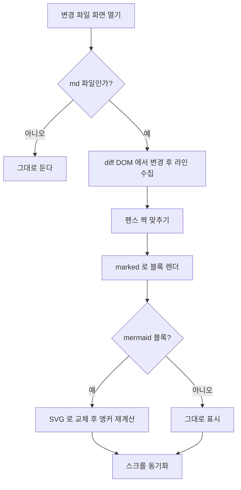
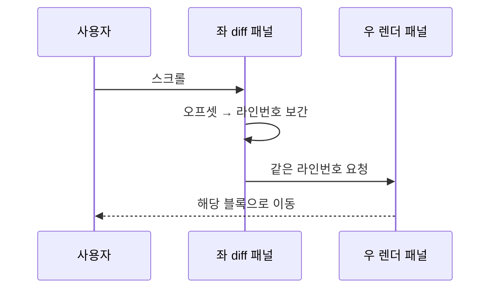
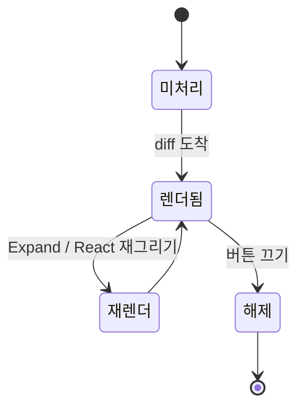

# 렌더링 파이프라인

이 문서의 다이어그램은 우측 패널에서 GitHub 본문과 같이 그림으로 나온다.
가운데 몇 줄만 고친 커밋을 열면 펜스가 diff 밖으로 밀려 코드블록으로 남는 것도 볼 수 있다.

## 파일 하나가 2단으로 바뀌기까지

## 좌우 스크롤이 맞춰지는 순서

## 파일 블록의 상태

> 다이어그램 문법이 틀리면 그 자리는 코드블록으로 남고 실패 이유가 한 줄 붙는다.
